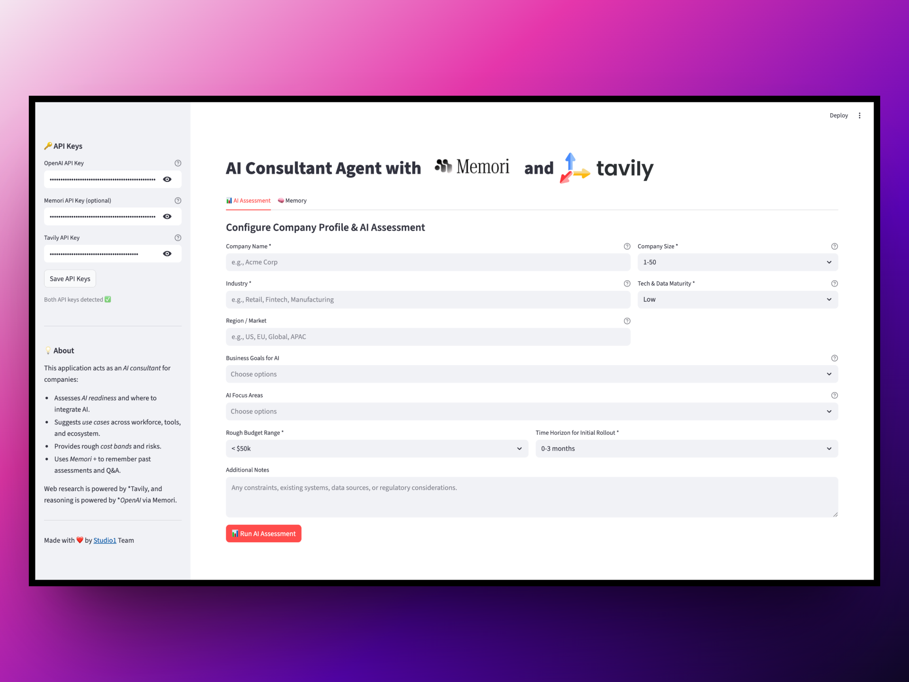

## AI Consultant Agent with Memori

An AI-powered consulting agent that uses **Memori v3** as a long-term memory fabric and **Tavily** for research. Built with Streamlit for the UI.

## Features

- 🧠 **AI Readiness Assessment**: Analyze a company’s AI maturity, goals, and constraints.
- 🎯 **Use-Case Recommendations**: Suggest where to integrate AI (workflows, CX, analytics, product, ecosystem).
- 💵 **Cost Bands**: Provide rough cost bands and complexity for proposed AI initiatives.
- ⚙️ **Web / Case-Study Research**: Use **Tavily** to pull in relevant case studies and industry examples.
- 🧾 **Persistent Memory (Memori v3)**: Store and reuse context across assessments and follow-up questions.

## Prerequisites

- Python 3.11 or higher
- [uv](https://github.com/astral-sh/uv) package manager (fast Python package installer)
- OpenAI API key (`OPENAI_API_KEY`)
- Tavily API key (`TAVILY_API_KEY`)
- Memori API key (`MEMORI_API_KEY`)
- (Optional) `SQLITE_DB_PATH` if you want to override the default `./memori.sqlite` path

## Installation

### 1. Install `uv`

If you don't have `uv` installed:

```bash
curl -LsSf https://astral.sh/uv/install.sh | sh
```

Or using pip:

```bash
pip install uv
```

### 2. Clone and Navigate

From the root of the main repo:

```bash
cd ai_consultant_agent
```

### 3. Install Dependencies with `uv`

Using `uv` (recommended):

```bash
uv sync
```

This will:

- Create a virtual environment automatically.
- Install all dependencies from `pyproject.toml`.
- Make the project ready to run.

### 4. Set Up Environment Variables

Create a `.env` file in this directory:

```bash
OPENAI_API_KEY=your_openai_api_key_here
TAVILY_API_KEY=your_tavily_api_key_here
# Optional:
# SQLITE_DB_PATH=./memori.sqlite
```

## Usage

### Run the Application

Activate the virtual environment created by `uv` and run Streamlit:

```bash
# Activate the virtual environment (created by uv)
source .venv/bin/activate  # On macOS/Linux
# or
.venv\Scripts\activate     # On Windows

# Run the app
streamlit run app.py
```

Or using `uv` directly:

```bash
uv run streamlit run app.py
```

The app will create (or use) a local **SQLite database** (default `./memori.sqlite`) for Memori v3.

In the UI you can:

1. **Enter API Keys** in the sidebar (or rely on `.env`).
2. **Configure a Company Profile** in the **AI Assessment** tab.
3. **Run an AI Assessment** to get:
   - Recommendation (adopt AI now / later / not yet),
   - Priority use cases,
   - Cost bands & risks,
   - Next-step plan.
4. **Use the Memory Tab** to ask about:
   - Previous recommendations,
   - Previously suggested cost bands,
   - How new ideas relate to earlier assessments.

## Project Structure

```text
ai_consultant_agent/
├── app.py              # Streamlit interface (assessment + memory tabs)
├── workflow.py         # Tavily research + OpenAI-based consulting workflow
├── pyproject.toml      # Project dependencies (uv format)
├── README.md           # This file
├── requirements.txt    # PIP-style dependency list
├── .streamlit/
│   └── config.toml     # Streamlit theme (light)
├── assets/             # Logos (reused from other agents)
└── memori.sqlite       # Memori database (created automatically)
```

## License

See the main repository LICENSE file.

## Contributing

Contributions are welcome! Please feel free to submit a Pull Request.

---

Made with ❤️ by [Studio1](https://www.Studio1hq.com) Team
